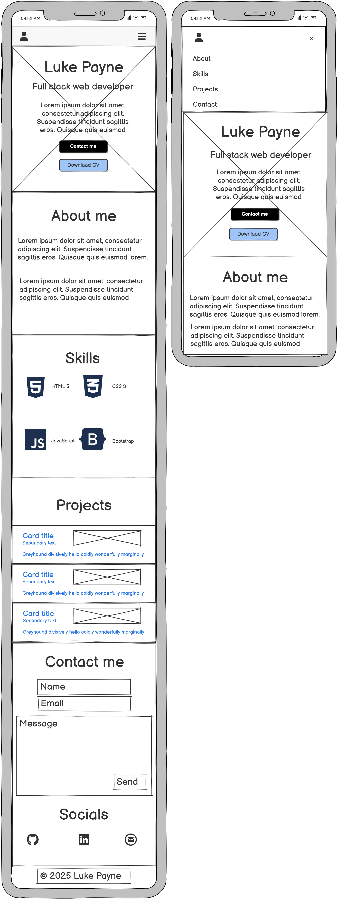

# Luke Payne | Portfolio

## Project Description

This is a personal portfolio website built as Milestone Project 1 for the 
[Code Institute](https://codeinstitute.net/) Level 5 Full Stack Web Development 
course. The site is built using HTML5 and CSS3 with Bootstrap 5 used to support 
responsive layout and design.

The portfolio is designed to provide a professional online presence that 
introduces me as a developing full stack web developer. It presents my technical 
skills, showcases my projects, and provides a clear route for potential employers 
and collaborators to get in touch.

The site is fully responsive across mobile, tablet, and desktop screen sizes and 
has been designed with accessibility and usability at its core.

## Live Site
[View the live site here](#) ← replace with GitHub Pages URL once deployed

## Project Management

This project was planned and tracked using a GitHub Project board following 
an agile approach. User stories were logged as issues and prioritised using 
the MoSCoW method:

- **Must Have** — features required for the project to meet its core goals
- **Should Have** — important features that add significant value but are not critical
- **Could Have** — desirable features that will only be implemented if time allows

Progress was tracked through the following stages:

- To Do
- In Progress
- Done

[View the Project Board here](https://github.com/users/lukepayne268-tech/projects/4)

# UX Design
## Business Goals

The primary goal of this portfolio site is to establish a professional online 
presence that showcases my skills, projects, and experience as a developing 
full stack web developer. The site is designed to:

- Present my technical abilities and growth to potential employers and recruiters
- Provide a central, easily accessible point of contact for professional opportunities
- Demonstrate my front end development skills through the design and build of 
the site itself
- Document my progression through the Code Institute Full Stack Web Development 
course via real project examples

The site serves as both a **professional marketing tool** and a **live demonstration** 
of my current capabilities — the quality of the site itself is as much a part of 
the portfolio as the projects it showcases.

### User stories 
**As a Code Institute assessor,**

I want to see a clearly structured, well-documented portfolio site so that I can evaluate the student's HTML and CSS skills.  
I want to see evidence of responsive design so that I can confirm the site works across different screen sizes.  
I want to be able to navigate between all sections of the site easily so that I can assess the full scope of the project.  
I want to read a thorough README so that I can understand the developer's planning process, design decisions, and testing approach.  
I want to see the project properly version controlled and deployed so that I can verify the development process and access the live site.

**As a recruiter / employer,**

I want to immediately understand who the developer is and what they do so that I can quickly assess their suitability.  
I want to see examples of their projects so that I can evaluate the quality and range of their work.  
I want to see a clear list of their technical skills so that I can match them against a job requirement.  
I want to find contact details easily so that I can get in touch about opportunities.  
I want to be able to download or view a CV so that I can review their full background.  

**As a general visitor,**

I want the site to load quickly and be easy to navigate so that I can find what I need without frustration.  
I want the site to work well on my mobile device so that I can browse comfortably on any screen.  
I want to find links to the developer's GitHub so that I can explore their code and other projects.  

## Colour Scheme

The portfolio uses a three-colour palette chosen for clarity, professionalism, and accessibility.

| Role | Swatch | Colour | Hex |
|---|---|---|---|
| Background |  | Pastel Coconut White | `#FAF0D7` |
| Primary Text / Dark Sections |  | Charcoal | `#36454F` |
| Accent |  | Sage Green | `#84CC16` |

### Accessibility
All foreground and background colour combinations were tested using the [WebAIM Contrast Checker](https://webaim.org/resources/contrastchecker/) to ensure compliance with WCAG 2.1 AA standards.

| Foreground | Background | Ratio | Result |
|---|---|---|---|
| Charcoal `#36454F` | Pastel Coconut White `#FAF0D7` |8.72:1 |✅ Pass |
| Pastel Coconut White `#FAF0D7` | Charcoal `#36454F` |8.72:1 |✅ Pass |
| Sage Green `#84CC16` | Charcoal `#36454F` |5.01:1 |✅ Pass |
| Charcoal `#36454F` | Sage Green `#84CC16` |5.01:1 |✅ Pass |

## !!!Need to repeat above process for dark mode if implemented!!!

## Typography

All fonts are sourced from [Google Fonts](https://fonts.google.com/) and were 
selected to complement the warm, professional feel of the colour palette.

### Fonts Used

| Role | Font | Weight |
|---|---|---|
| Headings | [Montserrat](https://fonts.google.com/specimen/Montserrat) | 600, 700 |
| Body Text | [Lato](https://fonts.google.com/specimen/Lato) | 400, 700 |

### Reasoning

**Montserrat** was chosen for headings due to its clean, modern appearance and 
strong visual weight. It projects confidence and professionalism, making it well 
suited for a developer portfolio targeting recruiters.

**Lato** was chosen for body text due to its high readability across all screen 
sizes and its neutral, friendly tone. It pairs well with Montserrat without 
competing for attention.

A clear typographic hierarchy is maintained throughout the site using a 
combination of font size, weight, and spacing to guide the user's eye through 
each section naturally.

### Fallback Fonts

In the event Google Fonts fails to load, the following fallback stack is used:

| Role | Fallback |
|---|---|
| Headings | sans-serif |
| Body Text | sans-serif |

## Wireframes

Wireframes were created using [Balsamiq](https://balsamiq.com/) to plan the
layout and structure of the site across all screen sizes. Each breakpoint 
reflects Bootstrap 5's responsive grid system.

| Breakpoint | Screen Size |
|---|---|
| Mobile | < 768px |
| Tablet & Desktop | 768px — 1399px |
| XL Screen | 1400px+ |

> ### Mobile
> - Displays as a single scrolling page with a collapsible navigation menu. 
> - All sections stack vertically in a single column layout.

> ### Tablet & Desktop
> - The layout remains consistent across tablet and desktop screen sizes.

> ### XL Screen
> **Pending amendments to XL wireframe:**
> - Add profile photo to hero section and reinstate Download CV button alongside Contact Me
> - Reduce empty space in skills section or add intro line
> - Reduce projects from four cards to three
  

## Mockups

# Testing

## Manual Testing

| Feature | Expected | Testing | Result | Fix |
|---|---|---|---|---|
| Navigation links | Each link scrolls to the correct section | Clicked each nav link | | |
| Contact form | Form submits successfully via Formspree | Completed and submitted form | | |
| CV download | PDF opens or downloads on click | Clicked download CV button | | |
| Social links | Each link opens correct profile in a new tab | Clicked each social icon | | |
| Responsive layout | Site displays correctly on all screen sizes | Tested in Chrome DevTools at 320px, 768px, 1200px, 1400px | | |
| Hero CTA button | Contact me button scrolls to contact section | Clicked button | | |

## Validator Testing

| Validator | Result |
|---|---|
| [W3C HTML Validator](https://validator.w3.org/) | |
| [W3C CSS Validator](https://jigsaw.w3.org/css-validator/) | |

## Accessibility Testing

| Tool | Result |
|---|---|
| [WebAIM Contrast Checker](https://webaim.org/resources/contrastchecker/) | All colour combinations pass WCAG 2.1 AA |
| [WAVE Accessibility Tool](https://wave.webaim.org/) | |

## Browser Compatibility

| Browser | Result |
|---|---|
| Chrome | |
| Firefox | |
| Safari | |
| Edge | |

## Bugs Discovered

| Bug | Fix |
|---|---|
| | |

---

# Deployment

The site was deployed to GitHub Pages using the following steps:

1. Navigate to the repository on GitHub
2. Click **Settings**
3. Click **Pages** in the left hand menu
4. Under **Source** select **Deploy from a branch**
5. Under **Branch** select **main** and **/root** then click **Save**
6. Wait a few minutes then refresh the page — the live URL will appear at the top of the Pages section

The live site can be found here: [Luke Payne Portfolio](#) ← replace with your GitHub Pages URL

### Local Deployment

To run this project locally:

1. Navigate to the repository on GitHub
2. Click the green **Code** button
3. Copy the HTTPS URL
4. Open your terminal and navigate to your chosen directory
5. Type `git clone` followed by the copied URL
6. Press enter — the project will be cloned to your local machine

---

# Credits

## Code

| Source | Use |
|---|---|
| [Bootstrap 5](https://getbootstrap.com/) | Responsive grid, navbar, and card components |
| [Bootstrap JS](https://getbootstrap.com/docs/5.0/getting-started/introduction/) | Navbar toggle and interactive components |
| [Formspree](https://formspree.io/) | Contact form submission handling |
| [Font Awesome](https://fontawesome.com/) | Icons throughout the site |
| [Google Fonts](https://fonts.google.com/) | Montserrat and Lato typefaces |

## Content

All written content was produced by Luke Payne.

## Media

| Source | Use |
|---|---|
| | |

## Tools & Resources

| Tool | Use |
|---|---|
| [Balsamiq](https://balsamiq.com/) | Wireframe design |
| [Bootstrap 5](https://getbootstrap.com/) | Responsive grid, navbar, and card components |
| [WebAIM Contrast Checker](https://webaim.org/resources/contrastchecker/) | Colour accessibility testing |
| [TinyPNG](https://tinypng.com/) | Image compression |
| [Google Fonts](https://fonts.google.com/) | Font selection and import |
| [Font Awesome](https://fontawesome.com/) | Icon library |

## AI Assistance

[Claude by Anthropic](https://claude.ai/) was used as a planning and documentation 
aid throughout the development of this project. Its use was limited strictly to 
the planning and documentation phases and did not extend to the generation of any 
code, design, or content featured on the site itself.

Specifically, Claude assisted with:

- Structuring and articulating user stories and acceptance criteria based on goals 
and target audience defined by me
- Advising on README structure and documentation best practices
- Providing guidance on colour scheme, typography, and design decisions which were 
then researched, reviewed, and finalised by me
- Answering questions about tools, workflows, and industry best practices

All final decisions regarding design, content, and implementation were made by me. 
Claude was used in the same spirit as a mentor, tutor, or peer — as a sounding 
board to help me think through and document my ideas clearly and professionally.