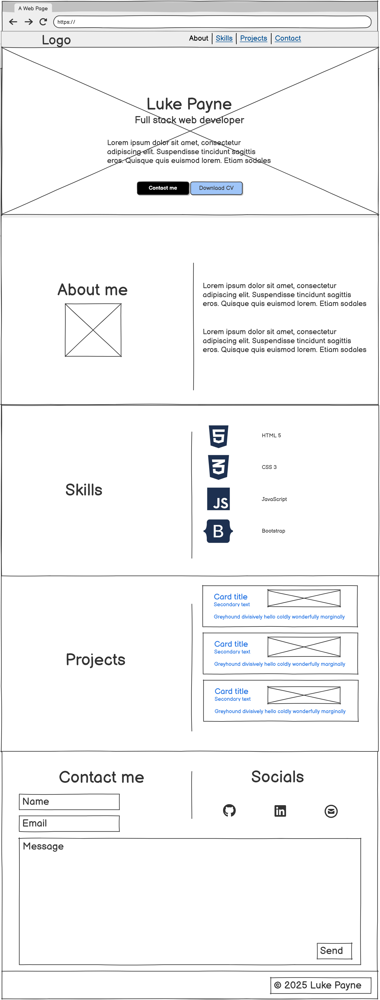

# Luke Payne | Portfolio

## Project Description

This is a personal portfolio website built as Milestone Project 1 for the 
[Code Institute](https://codeinstitute.net/) Level 5 Full Stack Web Development 
course. The site is built using HTML5 and CSS3 with Bootstrap 5 used to support 
responsive layout and design.

The portfolio is designed to provide a professional online presence that 
introduces me as a developing full stack web developer. It presents my technical 
skills, showcases my projects, and provides a clear route for potential employers 
and collaborators to get in touch.

The site is fully responsive across mobile, tablet, and desktop screen sizes and 
has been designed with accessibility and usability at its core.

## Live Site
[View the live site here](#) ← replace with GitHub Pages URL once deployed

## UX
## Business Goals

The primary goal of this portfolio site is to establish a professional online 
presence that showcases my skills, projects, and experience as a developing 
full stack web developer. The site is designed to:

- Present my technical abilities and growth to potential employers and recruiters
- Provide a central, easily accessible point of contact for professional opportunities
- Demonstrate my front end development skills through the design and build of 
the site itself
- Document my progression through the Code Institute Full Stack Web Development 
course via real project examples

The site serves as both a **professional marketing tool** and a **live demonstration** 
of my current capabilities — the quality of the site itself is as much a part of 
the portfolio as the projects it showcases.

### User stories 

## Wireframes

Wireframes were created using [Balsamiq](https://balsamiq.com/).

### Mobile

### Tablet

### Desktop

## Colour Scheme

The portfolio uses a three-colour palette chosen for clarity, professionalism, and accessibility.

| Role | Swatch | Colour | Hex |
|---|---|---|---|
| Background |  | Pastel Coconut White | `#FAF0D7` |
| Primary Text / Dark Sections |  | Charcoal | `#36454F` |
| Accent |  | Sage Green | `#84CC16` |

### Accessibility
All foreground and background colour combinations were tested using the [WebAIM Contrast Checker](https://webaim.org/resources/contrastchecker/) to ensure compliance with WCAG 2.1 AA standards.

| Foreground | Background | Ratio | Result |
|---|---|---|---|
| Charcoal `#36454F` | Pastel Coconut White `#FAF0D7` |8.72:1 |✅ Pass |
| Pastel Coconut White `#FAF0D7` | Charcoal `#36454F` |8.72:1 |✅ Pass |
| Sage Green `#84CC16` | Charcoal `#36454F` |5.01:1 |✅ Pass |
| Charcoal `#36454F` | Sage Green `#84CC16` |5.01:1 |✅ Pass |

## !!!Need to repeat above process for dark mode if implemented!!!
## Mockups

## Credits

### Tools/Resources
[Claude by Anthropic](https://claude.ai/login) was used during the planning phase of this project as a thinking aid. Specifically, it helped me structure and articulate my user stories and acceptance criteria after I had defined my project goals and target audience. All design decisions, code, layout, and content were written and implemented by me. Claude was used in the same spirit as a mentor or tutor — to help me think through and document my ideas clearly, not to generate the project itself.

### Code
### Content
### Media

## Deployment

##  Bugs discovered

## Testing
### Expected
### Testing
### Result
### Fix